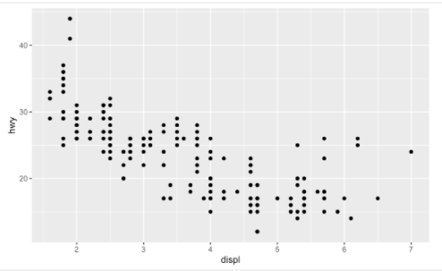
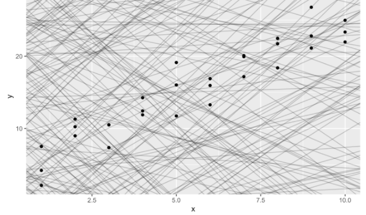

# Welcome
This is the website for “R for Data Science”. This book will teach you how to do data science with R: You’ll learn how to get your data into R, get it into the most useful structure, transform it, visualise it and model it. In this book, you will find a practicum of skills for data science. Just as a chemist learns how to clean test tubes and stock a lab, you’ll learn how to clean data and draw plots—and many other things besides. These are the skills that allow data science to happen, and here you will find the best practices for doing each of these things with R. You’ll learn how to use the grammar of graphics, literate programming, and reproducible research to save time. You’ll also learn how to manage cognitive resources to facilitate discoveries when wrangling, visualising, and exploring data.


This website is (and will always be) free to use, and is licensed under the Creative Commons Attribution-NonCommercial-NoDerivs 3.0 License. If you’d like a physical copy of the book, you can order it from amazon; it was published by O’Reilly in January 2017. If you’d like to give back please make a donation to Kākāpō Recovery: the kākāpō (which appears on the cover of R4DS) is a critically endangered native NZ parrot; there are only 213 left.

Please note that R4DS uses a Contributor Code of Conduct. By contributing to this book, you agree to abide by its terms.

Acknowledgements
R4DS is a collaborative effort and many people have contributed fixes and improvements via pull request: adi pradhan (@adidoit), Andrea Gilardi (@agila5), Ajay Deonarine (@ajay-d), @AlanFeder, pete (@alonzi), Alex (@ALShum), Andrew Landgraf (@andland), @andrewmacfarland, Michael Henry (@aviast), Mara Averick (@batpigandme), Brent Brewington (@bbrewington), Bill Behrman (@behrman), Ben Herbertson (@benherbertson), Ben Marwick (@benmarwick), Ben Steinberg (@bensteinberg), Brandon Greenwell (@bgreenwell), Brett Klamer (@bklamer), Christian Mongeau (@chrMongeau), Cooper Morris (@coopermor), Colin Gillespie (@csgillespie), Rademeyer Vermaak (@csrvermaak), Abhinav Singh (@curious-abhinav), Curtis Alexander (@curtisalexander), Christian G. Warden (@cwarden), Kenny Darrell (@darrkj), David Rubinger (@davidrubinger), David Clark (@DDClark), Derwin McGeary (@derwinmcgeary), Daniel Gromer (@dgromer), @djbirke, Devin Pastoor (@dpastoor), Julian During (@duju211), Dylan Cashman (@dylancashman), Dirk Eddelbuettel (@eddelbuettel), Edwin Thoen (@EdwinTh), Ahmed El-Gabbas (@elgabbas), Eric Watt (@ericwatt), Erik Erhardt (@erikerhardt), Etienne B. Racine (@etiennebr), Everett Robinson (@evjrob), Flemming Villalona (@flemingspace), Floris Vanderhaeghe (@florisvdh), Garrick Aden-Buie (@gadenbuie), Garrett Grolemund (@garrettgman), Josh Goldberg (@GoldbergData), bahadir cankardes (@gridgrad), Gustav W Delius (@gustavdelius), Hadley Wickham (@hadley), Hao Chen (@hao-trivago), Harris McGehee (@harrismcgehee), Hengni Cai (@hengnicai), Ian Sealy (@iansealy), Ian Lyttle (@ijlyttle), Ivan Krukov (@ivan-krukov), Jacob Kaplan (@jacobkap), Jazz Weisman (@jazzlw), John D. Storey (@jdstorey), Jeff Boichuk (@jeffboichuk), Gregory Jefferis (@jefferis), 蒋雨蒙 (@JeldorPKU), Jennifer (Jenny) Bryan (@jennybc), Jen Ren (@jenren), Jeroen Janssens (@jeroenjanssens), Jim Hester (@jimhester), JJ Chen (@jjchern), Joanne Jang (@joannejang), John Sears (@johnsears), @jonathanflint, Jon Calder (@jonmcalder), Jonathan Page (@jonpage), Justinas Petuchovas (@jpetuchovas), Jose Roberto Ayala Solares (@jroberayalas), Julia Stewart Lowndes (@jules32), Sonja (@kaetschap), Kara Woo (@karawoo), Katrin Leinweber (@katrinleinweber), Karandeep Singh (@kdpsingh), Kyle Humphrey (@khumph), Kirill Sevastyanenko (@kirillseva), @koalabearski, Kirill Müller (@krlmlr), Noah Landesberg (@landesbergn), @lindbrook, Mauro Lepore (@maurolepore), Mark Beveridge (@mbeveridge), Matt Herman (@mfherman), Mine Cetinkaya-Rundel (@mine-cetinkaya-rundel), Matthew Hendrickson (@mjhendrickson), @MJMarshall, Mustafa Ascha (@mustafaascha), Nelson Areal (@nareal), Nate Olson (@nate-d-olson), Nathanael (@nateaff), Nick Clark (@nickclark1000), @nickelas, Nirmal Patel (@nirmalpatel), Nina Munkholt Jakobsen (@nmjakobsen), Jakub Nowosad (@Nowosad), Peter Hurford (@peterhurford), Patrick Kennedy (@pkq), Radu Grosu (@radugrosu), Ranae Dietzel (@Ranae), Robin Gertenbach (@rgertenbach), Richard Zijdeman (@rlzijdeman), Robin (@Robinlovelace), Emily Robinson (@robinsones), Rohan Alexander (@RohanAlexander), Romero Morais (@RomeroBarata), Albert Y. Kim (@rudeboybert), Saghir (@saghirb), Jonas (@sauercrowd), Robert Schuessler (@schuess), Seamus McKinsey (@seamus-mckinsey), @seanpwilliams, Luke Smith (@seasmith), Matthew Sedaghatfar (@sedaghatfar), Sebastian Kraus (@sekR4), Sam Firke (@sfirke), Shannon Ellis (@ShanEllis), @shoili, S’busiso Mkhondwane (@sibusiso16), @spirgel, Steven M. Mortimer (@StevenMMortimer), Stéphane Guillou (@stragu), Sergiusz Bleja (@svenski), Tal Galili (@talgalili), Tim Waterhouse (@timwaterhouse), TJ Mahr (@tjmahr), Thomas Klebel (@tklebel), Tom Prior (@tomjamesprior), Terence Teo (@tteo), Will Beasley (@wibeasley), @yahwes, Yihui Xie (@yihui), Yiming (Paul) Li (@yimingli), Hiroaki Yutani (@yutannihilation), @zeal626, Azza Ahmed (@zo0z)

R4DS is hosted by https://www.netlify.com as part of their support of open source software and communities.

# 1 Introduction
Data science is an exciting discipline that allows you to turn raw data into understanding, insight, and knowledge. The goal of “R for Data Science” is to help you learn the most important tools in R that will allow you to do data science. After reading this book, you’ll have the tools to tackle a wide variety of data science challenges, using the best parts of R.

## 1.1 What you will learn
Data science is a huge field, and there’s no way you can master it by reading a single book. The goal of this book is to give you a solid foundation in the most important tools. Our model of the tools needed in a typical data science project looks something like this:


First you must import your data into R. This typically means that you take data stored in a file, database, or web application programming interface (API), and load it into a data frame in R. If you can’t get your data into R, you can’t do data science on it!

Once you’ve imported your data, it is a good idea to tidy it. Tidying your data means storing it in a consistent form that matches the semantics of the dataset with the way it is stored. In brief, when your data is tidy, each column is a variable, and each row is an observation. Tidy data is important because the consistent structure lets you focus your struggle on questions about the data, not fighting to get the data into the right form for different functions.

Once you have tidy data, a common first step is to transform it. Transformation includes narrowing in on observations of interest (like all people in one city, or all data from the last year), creating new variables that are functions of existing variables (like computing speed from distance and time), and calculating a set of summary statistics (like counts or means). Together, tidying and transforming are called wrangling, because getting your data in a form that’s natural to work with often feels like a fight!

Once you have tidy data with the variables you need, there are two main engines of knowledge generation: visualisation and modelling. These have complementary strengths and weaknesses so any real analysis will iterate between them many times.

Visualisation is a fundamentally human activity. A good visualisation will show you things that you did not expect, or raise new questions about the data. A good visualisation might also hint that you’re asking the wrong question, or you need to collect different data. Visualisations can surprise you, but don’t scale particularly well because they require a human to interpret them.

Models are complementary tools to visualisation. Once you have made your questions sufficiently precise, you can use a model to answer them. Models are a fundamentally mathematical or computational tool, so they generally scale well. Even when they don’t, it’s usually cheaper to buy more computers than it is to buy more brains! But every model makes assumptions, and by its very nature a model cannot question its own assumptions. That means a model cannot fundamentally surprise you.

The last step of data science is communication, an absolutely critical part of any data analysis project. It doesn’t matter how well your models and visualisation have led you to understand the data unless you can also communicate your results to others.

Surrounding all these tools is programming. Programming is a cross-cutting tool that you use in every part of the project. You don’t need to be an expert programmer to be a data scientist, but learning more about programming pays off because becoming a better programmer allows you to automate common tasks, and solve new problems with greater ease.

You’ll use these tools in every data science project, but for most projects they’re not enough. There’s a rough 80-20 rule at play; you can tackle about 80% of every project using the tools that you’ll learn in this book, but you’ll need other tools to tackle the remaining 20%. Throughout this book we’ll point you to resources where you can learn more.

## 1.2 How this book is organised
The previous description of the tools of data science is organised roughly according to the order in which you use them in an analysis (although of course you’ll iterate through them multiple times). In our experience, however, this is not the best way to learn them:

* Starting with data ingest and tidying is sub-optimal because 80% of the time it’s routine and boring, and the other 20% of the time it’s weird and frustrating. That’s a bad place to start learning a new subject! Instead, we’ll start with visualisation and transformation of data that’s already been imported and tidied. That way, when you ingest and tidy your own data, your motivation will stay high because you know the pain is worth it.
* Some topics are best explained with other tools. For example, we believe that it’s easier to understand how models work if you already know about visualisation, tidy data, and programming.
* Programming tools are not necessarily interesting in their own right, but do allow you to tackle considerably more challenging problems. We’ll give you a selection of programming tools in the middle of the book, and then you’ll see how they can combine with the data science tools to tackle interesting modelling problems.

Within each chapter, we try and stick to a similar pattern: start with some motivating examples so you can see the bigger picture, and then dive into the details. Each section of the book is paired with exercises to help you practice what you’ve learned. While it’s tempting to skip the exercises, there’s no better way to learn than practicing on real problems.

## 1.3 What you won't learn
There are some important topics that this book doesn’t cover. We believe it’s important to stay ruthlessly focused on the essentials so you can get up and running as quickly as possible. That means this book can’t cover every important topic.

### 1.3.1 Big data
This book proudly focuses on small, in-memory datasets. This is the right place to start because you can’t tackle big data unless you have experience with small data. The tools you learn in this book will easily handle hundreds of megabytes of data, and with a little care you can typically use them to work with 1-2 Gb of data. If you’re routinely working with larger data (10-100 Gb, say), you should learn more about data.table. This book doesn’t teach data.table because it has a very concise interface which makes it harder to learn since it offers fewer linguistic cues. But if you’re working with large data, the performance payoff is worth the extra effort required to learn it.

If your data is bigger than this, carefully consider if your big data problem might actually be a small data problem in disguise. While the complete data might be big, often the data needed to answer a specific question is small. You might be able to find a subset, subsample, or summary that fits in memory and still allows you to answer the question that you’re interested in. The challenge here is finding the right small data, which often requires a lot of iteration.

Another possibility is that your big data problem is actually a large number of small data problems. Each individual problem might fit in memory, but you have millions of them. For example, you might want to fit a model to each person in your dataset. That would be trivial if you had just 10 or 100 people, but instead you have a million. Fortunately each problem is independent of the others (a setup that is sometimes called embarrassingly parallel), so you just need a system (like Hadoop or Spark) that allows you to send different datasets to different computers for processing. Once you’ve figured out how to answer the question for a single subset using the tools described in this book, you learn new tools like sparklyr, rhipe, and ddr to solve it for the full dataset.

### 1.3.2 Python, Julia, and friends
In this book, you won’t learn anything about Python, Julia, or any other programming language useful for data science. This isn’t because we think these tools are bad. They’re not! And in practice, most data science teams use a mix of languages, often at least R and Python.

However, we strongly believe that it’s best to master one tool at a time. You will get better faster if you dive deep, rather than spreading yourself thinly over many topics. This doesn’t mean you should only know one thing, just that you’ll generally learn faster if you stick to one thing at a time. You should strive to learn new things throughout your career, but make sure your understanding is solid before you move on to the next interesting thing.

We think R is a great place to start your data science journey because it is an environment designed from the ground up to support data science. R is not just a programming language, but it is also an interactive environment for doing data science. To support interaction, R is a much more flexible language than many of its peers. This flexibility comes with its downsides, but the big upside is how easy it is to evolve tailored grammars for specific parts of the data science process. These mini languages help you think about problems as a data scientist, while supporting fluent interaction between your brain and the computer.

### 1.3.3 Non-rectangular data
This book focuses exclusively on rectangular data: collections of values that are each associated with a variable and an observation. There are lots of datasets that do not naturally fit in this paradigm, including images, sounds, trees, and text. But rectangular data frames are extremely common in science and industry, and we believe that they are a great place to start your data science journey.

### 1.3.4 Hypothesis confirmation
It’s possible to divide data analysis into two camps: hypothesis generation and hypothesis confirmation (sometimes called confirmatory analysis). The focus of this book is unabashedly on hypothesis generation, or data exploration. Here you’ll look deeply at the data and, in combination with your subject knowledge, generate many interesting hypotheses to help explain why the data behaves the way it does. You evaluate the hypotheses informally, using your scepticism to challenge the data in multiple ways.

The complement of hypothesis generation is hypothesis confirmation. Hypothesis confirmation is hard for two reasons:

1. You need a precise mathematical model in order to generate falsifiable predictions. This often requires considerable statistical sophistication.
2. You can only use an observation once to confirm a hypothesis. As soon as you use it more than once you’re back to doing exploratory analysis. This means to do hypothesis confirmation you need to “preregister” (write out in advance) your analysis plan, and not deviate from it even when you have seen the data. We’ll talk a little about some strategies you can use to make this easier in modelling.

It’s common to think about modelling as a tool for hypothesis confirmation, and visualisation as a tool for hypothesis generation. But that’s a false dichotomy: models are often used for exploration, and with a little care you can use visualisation for confirmation. The key difference is how often do you look at each observation: if you look only once, it’s confirmation; if you look more than once, it’s exploration.

## 1.4 Prerequisites
We’ve made a few assumptions about what you already know in order to get the most out of this book. You should be generally numerically literate, and it’s helpful if you have some programming experience already. If you’ve never programmed before, you might find Hands on Programming with R by Garrett to be a useful adjunct to this book.

There are four things you need to run the code in this book: R, RStudio, a collection of R packages called the tidyverse, and a handful of other packages. Packages are the fundamental units of reproducible R code. They include reusable functions, the documentation that describes how to use them, and sample data.

### 1.4.1 R
To download R, go to CRAN, the comprehensive R archive network. CRAN is composed of a set of mirror servers distributed around the world and is used to distribute R and R packages. Don’t try and pick a mirror that’s close to you: instead use the cloud mirror, https://cloud.r-project.org, which automatically figures it out for you.

A new major version of R comes out once a year, and there are 2-3 minor releases each year. It’s a good idea to update regularly. Upgrading can be a bit of a hassle, especially for major versions, which require you to reinstall all your packages, but putting it off only makes it worse.

### 1.4.2 RStudio
RStudio is an integrated development environment, or IDE, for R programming. Download and install it from http://www.rstudio.com/download. RStudio is updated a couple of times a year. When a new version is available, RStudio will let you know. It’s a good idea to upgrade regularly so you can take advantage of the latest and greatest features. For this book, make sure you have at least RStudio 1.0.0.

When you start RStudio, you’ll see two key regions in the interface:


For now, all you need to know is that you type R code in the console pane, and press enter to run it. You’ll learn more as we go along!

### 1.4.3 The tidyverse
You’ll also need to install some R packages. An R package is a collection of functions, data, and documentation that extends the capabilities of base R. Using packages is key to the successful use of R. The majority of the packages that you will learn in this book are part of the so-called tidyverse. The packages in the tidyverse share a common philosophy of data and R programming, and are designed to work together naturally.

You can install the complete tidyverse with a single line of code:
```R
install.packages("tidyverse")
```
On your own computer, type that line of code in the console, and then press enter to run it. R will download the packages from CRAN and install them on to your computer. If you have problems installing, make sure that you are connected to the internet, and that https://cloud.r-project.org/ isn’t blocked by your firewall or proxy.

You will not be able to use the functions, objects, and help files in a package until you load it with library(). Once you have installed a package, you can load it with the library() function:
```R
library(tidyverse)
#> ── Attaching packages ─────────────────────────────────────── tidyverse 1.3.0 ──
#> ✔ ggplot2 3.3.2     ✔ purrr   0.3.4
#> ✔ tibble  3.0.3     ✔ dplyr   1.0.2
#> ✔ tidyr   1.1.2     ✔ stringr 1.4.0
#> ✔ readr   1.4.0     ✔ forcats 0.5.0
#> ── Conflicts ────────────────────────────────────────── tidyverse_conflicts() ──
#> ✖ dplyr::filter() masks stats::filter()
#> ✖ dplyr::lag()    masks stats::lag()
```
This tells you that tidyverse is loading the ggplot2, tibble, tidyr, readr, purrr, and dplyr packages. These are considered to be the core of the tidyverse because you’ll use them in almost every analysis.

Packages in the tidyverse change fairly frequently. You can see if updates are available, and optionally install them, by running tidyverse_update().

### 1.4.4 Other packages
There are many other excellent packages that are not part of the tidyverse, because they solve problems in a different domain, or are designed with a different set of underlying principles. This doesn’t make them better or worse, just different. In other words, the complement to the tidyverse is not the messyverse, but many other universes of interrelated packages. As you tackle more data science projects with R, you’ll learn new packages and new ways of thinking about data.

In this book we’ll use three data packages from outside the tidyverse:
```R
install.packages(c("nycflights13", "gapminder", "Lahman"))
```
These packages provide data on airline flights, world development, and baseball that we’ll use to illustrate key data science ideas.

## 1.5 Running R code
The previous section showed you a couple of examples of running R code. Code in the book looks like this:
```R
1 + 2
#> [1] 3
```
If you run the same code in your local console, it will look like this:
```R
> 1 + 2
[1] 3
```
There are two main differences. In your console, you type after the >, called the prompt; we don’t show the prompt in the book. In the book, output is commented out with #>; in your console it appears directly after your code. These two differences mean that if you’re working with an electronic version of the book, you can easily copy code out of the book and into the console.

Throughout the book we use a consistent set of conventions to refer to code:

* Functions are in a code font and followed by parentheses, like sum(), or mean().
* Other R objects (like data or function arguments) are in a code font, without parentheses, like flights or x.
* If we want to make it clear what package an object comes from, we’ll use the package name followed by two colons, like dplyr::mutate(), or nycflights13::flights. This is also valid R code.

## 1.6 Getting help and learning more
This book is not an island; there is no single resource that will allow you to master R. As you start to apply the techniques described in this book to your own data you will soon find questions that we do not answer. This section describes a few tips on how to get help, and to help you keep learning.

If you get stuck, start with Google. Typically adding “R” to a query is enough to restrict it to relevant results: if the search isn’t useful, it often means that there aren’t any R-specific results available. Google is particularly useful for error messages. If you get an error message and you have no idea what it means, try googling it! Chances are that someone else has been confused by it in the past, and there will be help somewhere on the web. (If the error message isn’t in English, run Sys.setenv(LANGUAGE = "en") and re-run the code; you’re more likely to find help for English error messages.)

If Google doesn’t help, try stackoverflow. Start by spending a little time searching for an existing answer, including [R] to restrict your search to questions and answers that use R. If you don’t find anything useful, prepare a minimal reproducible example or reprex. A good reprex makes it easier for other people to help you, and often you’ll figure out the problem yourself in the course of making it.

There are three things you need to include to make your example reproducible: required packages, data, and code.

1. Packages should be loaded at the top of the script, so it’s easy to see which ones the example needs. This is a good time to check that you’re using the latest version of each package; it’s possible you’ve discovered a bug that’s been fixed since you installed the package. For packages in the tidyverse, the easiest way to check is to run tidyverse_update().

2. The easiest way to include data in a question is to use dput() to generate the R code to recreate it. For example, to recreate the mtcars dataset in R, I’d perform the following steps:

    * Run dput(mtcars) in R
    * Copy the output
    * In my reproducible script, type mtcars <- then paste.
Try and find the smallest subset of your data that still reveals the problem.

3. Spend a little bit of time ensuring that your code is easy for others to read:

    * Make sure you’ve used spaces and your variable names are concise, yet informative.
    * Use comments to indicate where your problem lies.
    * Do your best to remove everything that is not related to the problem. The shorter your code is, the easier it is to understand, and the easier it is to fix.

Finish by checking that you have actually made a reproducible example by starting a fresh R session and copying and pasting your script in.

You should also spend some time preparing yourself to solve problems before they occur. Investing a little time in learning R each day will pay off handsomely in the long run. One way is to follow what Hadley, Garrett, and everyone else at RStudio are doing on the RStudio blog. This is where we post announcements about new packages, new IDE features, and in-person courses. You might also want to follow Hadley (@hadleywickham) or Garrett (@statgarrett) on Twitter, or follow @rstudiotips to keep up with new features in the IDE.

To keep up with the R community more broadly, we recommend reading http://www.r-bloggers.com: it aggregates over 500 blogs about R from around the world. If you’re an active Twitter user, follow the (#rstats) hashtag. Twitter is one of the key tools that Hadley uses to keep up with new developments in the community.

## 1.7 Acknowledgements
This book isn’t just the product of Hadley and Garrett, but is the result of many conversations (in person and online) that we’ve had with the many people in the R community. There are a few people we’d like to thank in particular, because they have spent many hours answering our dumb questions and helping us to better think about data science:

* Jenny Bryan and Lionel Henry for many helpful discussions around working with lists and list-columns.
* The three chapters on workflow were adapted (with permission), from http://stat545.com/block002_hello-r-workspace-wd-project.html by Jenny Bryan.
* Genevera Allen for discussions about models, modelling, the statistical learning perspective, and the difference between hypothesis generation and hypothesis confirmation.
* Yihui Xie for his work on the bookdown package, and for tirelessly responding to my feature requests.
* Bill Behrman for his thoughtful reading of the entire book, and for trying it out with his data science class at Stanford.
* The #rstats twitter community who reviewed all of the draft chapters and provided tons of useful feedback.
* Tal Galili for augmenting his dendextend package to support a section on clustering that did not make it into the final draft.

This book was written in the open, and many people contributed pull requests to fix minor problems. Special thanks goes to everyone who contributed via GitHub:

Thanks go to all contributers in alphabetical order: @a-rosenberg, A. s, Abhinav Singh, adi pradhan, Ahmed ElGabbas, Ajay Deonarine, @AlanFeder, Albert Y. Kim, @Alex, Andrea Gilardi, Andrew Landgraf, @andrewmacfarland, Angela Li, Azza Ahmed, bahadir cankardes, @batpigandme, @behrman, Ben Herbertson, Ben Marwick, Ben Steinberg, Benjamin Yeh, Bianca Peterson, Bill Behrman, @BirgerNi, @boardtc, Brandon Greenwell, Brent Brewington, Brett Klamer, Brian G. Barkley, Charlotte Wickham, Christian G. Warden, Christian Heinrich, Christian Mongeau, Colin Gillespie, Cooper Morris, Curtis Alexander, Daniel Gromer, David Clark, David Rubinger, Derwin McGeary, Devin Pastoor, Dirk Eddelbuettel, @djbirke, @DSGeoff, Dylan Cashman, Earl Brown, Edwin Thoen, Eric Watt, Erik Erhardt, Etienne B. Racine, Everett Robinson, Flemming Villalona, Floris Vanderhaeghe, Garrick Aden-Buie, George Wang, Gregory Jefferis, Gustav W Delius, Hao Chen, @harrismcgehee, Hengni Cai, Hiroaki Yutani, Hojjat Salmasian, Ian Lyttle, Ian Sealy, Ivan Krukov, Jacek Kolacz, Jacob Kaplan, Jakub Nowosad, Jazz Weisman, Jeff Boichuk, Jeffrey Arnold, Jen Ren, Jennifer (Jenny) Bryan, @jennybc, Jeroen Janssens, Jim Hester, @jjchern, Joanne Jang, Johannes Gruber, John Blischak, John D. Storey, John Sears, Jon Calder, @Jonas, Jonathan Page, @jonathanflint, Jose Roberto Ayala Solares, Josh Goldberg, @juandering, Julia Stewart Lowndes, Julian During, Justinas Petuchovas, @kaetschap, Kara de la Marck, Kara Woo, Katrin Leinweber, @kdpsingh, Kenny Darrell, Kirill Müller, Kirill Sevastyanenko, @koalabearski, Kunal Marwaha, @KyleHumphrey, Lawrence Wu, @lindbrook, Luke Smith, Luke W Johnston, Mara Averick, Maria Paula Caldas, Mark Beveridge, Matt Herman, Matthew Hendrickson, Matthew Sedaghatfar, @MattWittbrodt, Mauro Lepore, Michael Henry, Mine Cetinkaya-Rundel, @MJMarshall, Mustafa Ascha, @nate-d-olson, @nattalides, Nelson Areal, Nicholas Tierney, Nick Clark, @nickelas, Nina Munkholt Jakobsen, Nirmal Patel, Nischal Shrestha, Noah Landesberg, @nwaff, @OaCantona, Pablo E, Patrick Kennedy, @Paul, @pete, Peter Hurford, Rademeyer Vermaak, Radu Grosu, Ranae Dietzel, Riva Quiroga, @rlzijdeman, Rob Tenorio, Robert Schuessler, @robertchu03, Robin Gertenbach, @robinlovelace, @robinsones, Rohan Alexander, @RomeroBarata, S’busiso Mkhondwane, @Saghir, Sam Firke, Seamus McKinsey, @seamus-mckinsey, @seanpwilliams, Sebastian Kraus, Shannon Ellis, @shoili, @sibusiso16, @Sophiazj, @spirgel, Stéphane Guillou, Steve Mortimer, @svenski, Tal Galili, Terence Teo, Thomas Klebel, Tim Waterhouse, TJ Mahr, Tom Prior, @twgardner2, Ulrik Lyngs, Will Beasley, @yahwes, Yihui Xie, Yiming (Paul) Li, Yu Yu Aung, Zach Bogart, @zeal626, Zhuoer Dong, @蒋雨蒙.

## 1.8 Colophon
An online version of this book is available at http://r4ds.had.co.nz. It will continue to evolve in between reprints of the physical book. The source of the book is available at https://github.com/hadley/r4ds. The book is powered by https://bookdown.org which makes it easy to turn R markdown files into HTML, PDF, and EPUB.

This book was built with:
```R
sessioninfo::session_info(c("tidyverse"))
#> ─ Session info ───────────────────────────────────────────────────────────────
#>  setting  value                       
#>  version  R version 4.0.2 (2020-06-22)
#>  os       macOS Catalina 10.15.7      
#>  system   x86_64, darwin17.0          
#>  ui       X11                         
#>  language (EN)                        
#>  collate  en_US.UTF-8                 
#>  ctype    en_US.UTF-8                 
#>  tz       UTC                         
#>  date     2020-10-09                  
#> 
#> ─ Packages ───────────────────────────────────────────────────────────────────
#>  ! package      * version date       lib source             
#>    askpass        1.1     2019-01-13 [1] standard (@1.1)    
#>    assertthat     0.2.1   2019-03-21 [1] standard (@0.2.1)  
#>    backports      1.1.10  2020-09-15 [1] standard (@1.1.10) 
#>    base64enc      0.1-3   2015-07-28 [1] standard (@0.1-3)  
#>  R BH             <NA>    <NA>       [?] <NA>               
#>    blob           1.2.1   2020-01-20 [1] standard (@1.2.1)  
#>    broom          0.7.1   2020-10-02 [1] standard (@0.7.1)  
#>    callr          3.4.4   2020-09-07 [1] standard (@3.4.4)  
#>    cellranger     1.1.0   2016-07-27 [1] standard (@1.1.0)  
#>    cli            2.0.2   2020-02-28 [1] standard (@2.0.2)  
#>    clipr          0.7.0   2019-07-23 [1] standard (@0.7.0)  
#>    colorspace     1.4-1   2019-03-18 [1] standard (@1.4-1)  
#>  R cpp11          <NA>    <NA>       [?] <NA>               
#>    crayon         1.3.4   2017-09-16 [1] standard (@1.3.4)  
#>    curl           4.3     2019-12-02 [1] standard (@4.3)    
#>    DBI            1.1.0   2019-12-15 [1] standard (@1.1.0)  
#>    dbplyr         1.4.4   2020-05-27 [1] standard (@1.4.4)  
#>    digest         0.6.25  2020-02-23 [1] standard (@0.6.25) 
#>    dplyr        * 1.0.2   2020-08-18 [1] standard (@1.0.2)  
#>    ellipsis       0.3.1   2020-05-15 [1] standard (@0.3.1)  
#>    evaluate       0.14    2019-05-28 [1] standard (@0.14)   
#>    fansi          0.4.1   2020-01-08 [1] standard (@0.4.1)  
#>    farver         2.0.3   2020-01-16 [1] standard (@2.0.3)  
#>    forcats      * 0.5.0   2020-03-01 [1] standard (@0.5.0)  
#>    fs             1.5.0   2020-07-31 [1] standard (@1.5.0)  
#>    generics       0.0.2   2018-11-29 [1] standard (@0.0.2)  
#>    ggplot2      * 3.3.2   2020-06-19 [1] standard (@3.3.2)  
#>    glue           1.4.2   2020-08-27 [1] standard (@1.4.2)  
#>    gtable         0.3.0   2019-03-25 [1] standard (@0.3.0)  
#>    haven          2.3.1   2020-06-01 [1] standard (@2.3.1)  
#>    highr          0.8     2019-03-20 [1] standard (@0.8)    
#>    hms            0.5.3   2020-01-08 [1] standard (@0.5.3)  
#>    htmltools      0.5.0   2020-06-16 [1] standard (@0.5.0)  
#>    httr           1.4.2   2020-07-20 [1] standard (@1.4.2)  
#>    isoband        0.2.2   2020-06-20 [1] standard (@0.2.2)  
#>    jsonlite       1.7.1   2020-09-07 [1] standard (@1.7.1)  
#>    knitr          1.30    2020-09-22 [1] standard (@1.30)   
#>    labeling       0.3     2014-08-23 [1] standard (@0.3)    
#>    lattice        0.20-41 2020-04-02 [1] standard (@0.20-41)
#>    lifecycle      0.2.0   2020-03-06 [1] standard (@0.2.0)  
#>    lubridate      1.7.9   2020-06-08 [1] standard (@1.7.9)  
#>    magrittr       1.5     2014-11-22 [1] standard (@1.5)    
#>    markdown       1.1     2019-08-07 [1] standard (@1.1)    
#>    MASS           7.3-53  2020-09-09 [1] standard (@7.3-53) 
#>    Matrix         1.2-18  2019-11-27 [1] standard (@1.2-18) 
#>    mgcv           1.8-33  2020-08-27 [1] standard (@1.8-33) 
#>    mime           0.9     2020-02-04 [1] standard (@0.9)    
#>    modelr         0.1.8   2020-05-19 [1] standard (@0.1.8)  
#>    munsell        0.5.0   2018-06-12 [1] standard (@0.5.0)  
#>    nlme           3.1-149 2020-08-23 [1] standard (@3.1-149)
#>    openssl        1.4.3   2020-09-18 [1] standard (@1.4.3)  
#>    pillar         1.4.6   2020-07-10 [1] standard (@1.4.6)  
#>    pkgconfig      2.0.3   2019-09-22 [1] standard (@2.0.3)  
#>    processx       3.4.4   2020-09-03 [1] standard (@3.4.4)  
#>  R progress       <NA>    <NA>       [?] <NA>               
#>    ps             1.4.0   2020-10-07 [1] standard (@1.4.0)  
#>    purrr        * 0.3.4   2020-04-17 [1] standard (@0.3.4)  
#>    R6             2.4.1   2019-11-12 [1] standard (@2.4.1)  
#>    RColorBrewer   1.1-2   2014-12-07 [1] standard (@1.1-2)  
#>    Rcpp           1.0.5   2020-07-06 [1] standard (@1.0.5)  
#>    readr        * 1.4.0   2020-10-05 [1] standard (@1.4.0)  
#>    readxl         1.3.1   2019-03-13 [1] standard (@1.3.1)  
#>    rematch        1.0.1   2016-04-21 [1] standard (@1.0.1)  
#>    reprex         0.3.0   2019-05-16 [1] standard (@0.3.0)  
#>    rlang          0.4.7   2020-07-09 [1] standard (@0.4.7)  
#>    rmarkdown      2.3     2020-06-18 [1] standard (@2.3)    
#>    rstudioapi     0.11    2020-02-07 [1] standard (@0.11)   
#>    rvest          0.3.6   2020-07-25 [1] standard (@0.3.6)  
#>    scales         1.1.1   2020-05-11 [1] standard (@1.1.1)  
#>    selectr        0.4-2   2019-11-20 [1] standard (@0.4-2)  
#>    stringi        1.5.3   2020-09-09 [1] standard (@1.5.3)  
#>    stringr      * 1.4.0   2019-02-10 [1] standard (@1.4.0)  
#>    sys            3.4     2020-07-23 [1] standard (@3.4)    
#>  R testthat       <NA>    <NA>       [?] <NA>               
#>    tibble       * 3.0.3   2020-07-10 [1] standard (@3.0.3)  
#>    tidyr        * 1.1.2   2020-08-27 [1] standard (@1.1.2)  
#>    tidyselect     1.1.0   2020-05-11 [1] standard (@1.1.0)  
#>    tidyverse    * 1.3.0   2019-11-21 [1] standard (@1.3.0)  
#>    tinytex        0.26    2020-09-22 [1] standard (@0.26)   
#>    utf8           1.1.4   2018-05-24 [1] standard (@1.1.4)  
#>    vctrs          0.3.4   2020-08-29 [1] standard (@0.3.4)  
#>    viridisLite    0.3.0   2018-02-01 [1] standard (@0.3.0)  
#>    whisker        0.4     2019-08-28 [1] standard (@0.4)    
#>    withr          2.3.0   2020-09-22 [1] standard (@2.3.0)  
#>    xfun           0.18    2020-09-29 [1] standard (@0.18)   
#>    xml2           1.3.2   2020-04-23 [1] standard (@1.3.2)  
#>    yaml           2.2.1   2020-02-01 [1] standard (@2.2.1)  
#> 
#> [1] /Users/runner/work/_temp/Library
#> [2] /Library/Frameworks/R.framework/Versions/4.0/Resources/library
#> 
#>  R ── Package was removed from disk.
```

# Explore
# 2 Introduction
The goal of the first part of this book is to get you up to speed with the basic tools of data exploration as quickly as possible. Data exploration is the art of looking at your data, rapidly generating hypotheses, quickly testing them, then repeating again and again and again. The goal of data exploration is to generate many promising leads that you can later explore in more depth.


In this part of the book you will learn some useful tools that have an immediate payoff:

* Visualisation is a great place to start with R programming, because the payoff is so clear: you get to make elegant and informative plots that help you understand data. In data visualisation you’ll dive into visualisation, learning the basic structure of a ggplot2 plot, and powerful techniques for turning data into plots.
* Visualisation alone is typically not enough, so in data transformation you’ll learn the key verbs that allow you to select important variables, filter out key observations, create new variables, and compute summaries.
* Finally, in exploratory data analysis, you’ll combine visualisation and transformation with your curiosity and scepticism to ask and answer interesting questions about data.

Modelling is an important part of the exploratory process, but you don’t have the skills to effectively learn or apply it yet. We’ll come back to it in modelling, once you’re better equipped with more data wrangling and programming tools.

Nestled among these three chapters that teach you the tools of exploration are three chapters that focus on your R workflow. In workflow: basics, workflow: scripts, and workflow: projects you’ll learn good practices for writing and organising your R code. These will set you up for success in the long run, as they’ll give you the tools to stay organised when you tackle real projects.

# 3 Data visualisation
## 3.1 Introduction
> “The simple graph has brought more information to the data analyst’s mind than any other device.” — John Tukey

This chapter will teach you how to visualise your data using ggplot2. R has several systems for making graphs, but ggplot2 is one of the most elegant and most versatile. ggplot2 implements the grammar of graphics, a coherent system for describing and building graphs. With ggplot2, you can do more faster by learning one system and applying it in many places.

If you’d like to learn more about the theoretical underpinnings of ggplot2 before you start, I’d recommend reading “The Layered Grammar of Graphics”, http://vita.had.co.nz/papers/layered-grammar.pdf.

### 3.1.1 Prerequisites 
This chapter focusses on ggplot2, one of the core members of the tidyverse. To access the datasets, help pages, and functions that we will use in this chapter, load the tidyverse by running this code:
```R
library(tidyverse)
#> ── Attaching packages ─────────────────────────────────────── tidyverse 1.3.0 ──
#> ✔ ggplot2 3.3.2     ✔ purrr   0.3.4
#> ✔ tibble  3.0.3     ✔ dplyr   1.0.2
#> ✔ tidyr   1.1.2     ✔ stringr 1.4.0
#> ✔ readr   1.4.0     ✔ forcats 0.5.0
#> ── Conflicts ────────────────────────────────────────── tidyverse_conflicts() ──
#> ✖ dplyr::filter() masks stats::filter()
#> ✖ dplyr::lag()    masks stats::lag()
```
That one line of code loads the core tidyverse; packages which you will use in almost every data analysis. It also tells you which functions from the tidyverse conflict with functions in base R (or from other packages you might have loaded).

If you run this code and get the error message “there is no package called ‘tidyverse’”, you’ll need to first install it, then run library() once again.
```R
install.packages("tidyverse")
library(tidyverse)
```
You only need to install a package once, but you need to reload it every time you start a new session.

If we need to be explicit about where a function (or dataset) comes from, we’ll use the special form package::function(). For example, ggplot2::ggplot() tells you explicitly that we’re using the ggplot() function from the ggplot2 package.

## 3.2 First steps
Let’s use our first graph to answer a question: Do cars with big engines use more fuel than cars with small engines? You probably already have an answer, but try to make your answer precise. What does the relationship between engine size and fuel efficiency look like? Is it positive? Negative? Linear? Nonlinear?

### 3.2.1 The mpg data frame
You can test your answer with the mpg data frame found in ggplot2 (aka ggplot2::mpg). A data frame is a rectangular collection of variables (in the columns) and observations (in the rows). mpg contains observations collected by the US Environmental Protection Agency on 38 models of car.
```R
mpg
#> # A tibble: 234 x 11
#>   manufacturer model displ  year   cyl trans      drv     cty   hwy fl    class 
#>   <chr>        <chr> <dbl> <int> <int> <chr>      <chr> <int> <int> <chr> <chr> 
#> 1 audi         a4      1.8  1999     4 auto(l5)   f        18    29 p     compa…
#> 2 audi         a4      1.8  1999     4 manual(m5) f        21    29 p     compa…
#> 3 audi         a4      2    2008     4 manual(m6) f        20    31 p     compa…
#> 4 audi         a4      2    2008     4 auto(av)   f        21    30 p     compa…
#> 5 audi         a4      2.8  1999     6 auto(l5)   f        16    26 p     compa…
#> 6 audi         a4      2.8  1999     6 manual(m5) f        18    26 p     compa…
#> # … with 228 more rows
```
Among the variables in mpg are:

1. `displ`, a car’s engine size, in litres.

2. `hwy`, a car’s fuel efficiency on the highway, in miles per gallon (mpg). A car with a low fuel efficiency consumes more fuel than a car with a high fuel efficiency when they travel the same distance.

To learn more about `mpg`, open its help page by running `?mpg`.

### 3.2.2 Creating a ggplot
To plot mpg, run this code to put displ on the x-axis and hwy on the y-axis:
```R
ggplot(data = mpg) + 
  geom_point(mapping = aes(x = displ, y = hwy))
```


The plot shows a negative relationship between engine size (displ) and fuel efficiency (hwy). In other words, cars with big engines use more fuel. Does this confirm or refute your hypothesis about fuel efficiency and engine size?

With ggplot2, you begin a plot with the function ggplot(). ggplot() creates a coordinate system that you can add layers to. The first argument of ggplot() is the dataset to use in the graph. So ggplot(data = mpg) creates an empty graph, but it’s not very interesting so I’m not going to show it here.

You complete your graph by adding one or more layers to ggplot(). The function geom_point() adds a layer of points to your plot, which creates a scatterplot. ggplot2 comes with many geom functions that each add a different type of layer to a plot. You’ll learn a whole bunch of them throughout this chapter.

Each geom function in ggplot2 takes a mapping argument. This defines how variables in your dataset are mapped to visual properties. The mapping argument is always paired with aes(), and the x and y arguments of aes() specify which variables to map to the x and y axes. ggplot2 looks for the mapped variables in the data argument, in this case, mpg.

### 3.2.3 A graphing template
Let’s turn this code into a reusable template for making graphs with ggplot2. To make a graph, replace the bracketed sections in the code below with a dataset, a geom function, or a collection of mappings.
```R
ggplot(data = <DATA>) + 
  <GEOM_FUNCTION>(mapping = aes(<MAPPINGS>))
```
The rest of this chapter will show you how to complete and extend this template to make different types of graphs. We will begin with the <MAPPINGS> component.

### 3.2.4 Exercises
1. Run ggplot(data = mpg). What do you see?

    Q: ggplot()创建了一个坐标系，你可以往其中添加层。ggplot(data = mpg)创建了一个空的图片。

2. How many rows are in mpg? How many columns?

    Q: 234 * 11

3. What does the drv variable describe? Read the help for ?mpg to find out.

    Q: the type of drive train, where f = front-wheel drive, r = rear wheel drive, 4 = 4wd

4. Make a scatterplot of hwy vs cyl.

5. What happens if you make a scatterplot of class vs drv? Why is the plot not useful?

## 3.3 Aesthetic mappings
>“The greatest value of a picture is when it forces us to notice what we never expected to see.” — John Tukey

In the plot below, one group of points (highlighted in red) seems to fall outside of the linear trend. These cars have a higher mileage than you might expect. How can you explain these cars?

Let’s hypothesize that the cars are hybrids. One way to test this hypothesis is to look at the class value for each car. The class variable of the mpg dataset classifies cars into groups such as compact, midsize, and SUV. If the outlying points are hybrids, they should be classified as compact cars or, perhaps, subcompact cars (keep in mind that this data was collected before hybrid trucks and SUVs became popular).

You can add a third variable, like class, to a two dimensional scatterplot by mapping it to an aesthetic. An aesthetic is a visual property of the objects in your plot. Aesthetics include things like the size, the shape, or the color of your points. You can display a point (like the one below) in different ways by changing the values of its aesthetic properties. Since we already use the word “value” to describe data, let’s use the word “level” to describe aesthetic properties. Here we change the levels of a point’s size, shape, and color to make the point small, triangular, or blue:


You can convey information about your data by mapping the aesthetics in your plot to the variables in your dataset. For example, you can map the colors of your points to the class variable to reveal the class of each car.
```R
ggplot(data = mpg) + 
  geom_point(mapping = aes(x = displ, y = hwy, color = class))
```


(If you prefer British English, like Hadley, you can use colour instead of color.)

To map an aesthetic to a variable, associate the name of the aesthetic to the name of the variable inside aes(). ggplot2 will automatically assign a unique level of the aesthetic (here a unique color) to each unique value of the variable, a process known as scaling. ggplot2 will also add a legend that explains which levels correspond to which values.

The colors reveal that many of the unusual points are two-seater cars. These cars don’t seem like hybrids, and are, in fact, sports cars! Sports cars have large engines like SUVs and pickup trucks, but small bodies like midsize and compact cars, which improves their gas mileage. In hindsight, these cars were unlikely to be hybrids since they have large engines.

In the above example, we mapped class to the color aesthetic, but we could have mapped class to the size aesthetic in the same way. In this case, the exact size of each point would reveal its class affiliation. We get a warning here, because mapping an unordered variable (class) to an ordered aesthetic (size) is not a good idea.

```R
ggplot(data = mpg) + 
  geom_point(mapping = aes(x = displ, y = hwy, size = class))
#> Warning: Using size for a discrete variable is not advised.
```


Or we could have mapped class to the alpha aesthetic, which controls the transparency of the points, or to the shape aesthetic, which controls the shape of the points.

```R
# Left
ggplot(data = mpg) + 
  geom_point(mapping = aes(x = displ, y = hwy, alpha = class))

# Right
ggplot(data = mpg) + 
  geom_point(mapping = aes(x = displ, y = hwy, shape = class))
```


What happened to the SUVs? ggplot2 will only use six shapes at a time. By default, additional groups will go unplotted when you use the shape aesthetic.

For each aesthetic, you use aes() to associate the name of the aesthetic with a variable to display. The aes() function gathers together each of the aesthetic mappings used by a layer and passes them to the layer’s mapping argument. The syntax highlights a useful insight about x and y: the x and y locations of a point are themselves aesthetics, visual properties that you can map to variables to display information about the data.

Once you map an aesthetic, ggplot2 takes care of the rest. It selects a reasonable scale to use with the aesthetic, and it constructs a legend that explains the mapping between levels and values. For x and y aesthetics, ggplot2 does not create a legend, but it creates an axis line with tick marks and a label. The axis line acts as a legend; it explains the mapping between locations and values.

You can also set the aesthetic properties of your geom manually. For example, we can make all of the points in our plot blue:

```R
ggplot(data = mpg) + 
  geom_point(mapping = aes(x = displ, y = hwy), color = "blue")
```


Here, the color doesn’t convey information about a variable, but only changes the appearance of the plot. To set an aesthetic manually, set the aesthetic by name as an argument of your geom function; i.e. it goes outside of aes(). You’ll need to pick a level that makes sense for that aesthetic:

* The name of a color as a character string.
* The size of a point in mm.
* The shape of a point as a number, as shown in Figure 3.1.


Figure 3.1: R has 25 built in shapes that are identified by numbers. There are some seeming duplicates: for example, 0, 15, and 22 are all squares. The difference comes from the interaction of the colour and fill aesthetics. The hollow shapes (0–14) have a border determined by colour; the solid shapes (15–20) are filled with colour; the filled shapes (21–24) have a border of colour and are filled with fill.

### 3.3.1 Exercises
1. What’s gone wrong with this code? Why are the points not blue?

    Q: 括号的位置不对，应该改为`ggplot(data = mpg) + geom_point(mapping = aes(x = displ, y = hwy), color = "blue")`

```R
ggplot(data = mpg) + 
  geom_point(mapping = aes(x = displ, y = hwy, color = "blue"))
```

2. Which variables in mpg are categorical? Which variables are continuous? (Hint: type ?mpg to read the documentation for the dataset). How can you see this information when you run mpg?

3. Map a continuous variable to color, size, and shape. How do these aesthetics behave differently for categorical vs. continuous variables?

4. What happens if you map the same variable to multiple aesthetics?

5. What does the stroke aesthetic do? What shapes does it work with? (Hint: use ?geom_point)

6. What happens if you map an aesthetic to something other than a variable name, like aes(colour = displ < 5)? Note, you’ll also need to specify x and y.

    Q: 返回了一个逻辑值，TRUE and FALSE.

## 3.4 Common problems
As you start to run R code, you’re likely to run into problems. Don’t worry — it happens to everyone. I have been writing R code for years, and every day I still write code that doesn’t work!

Start by carefully comparing the code that you’re running to the code in the book. R is extremely picky, and a misplaced character can make all the difference. Make sure that every ( is matched with a ) and every " is paired with another ". Sometimes you’ll run the code and nothing happens. Check the left-hand of your console: if it’s a +, it means that R doesn’t think you’ve typed a complete expression and it’s waiting for you to finish it. In this case, it’s usually easy to start from scratch again by pressing ESCAPE to abort processing the current command.

One common problem when creating ggplot2 graphics is to put the + in the wrong place: it has to come at the end of the line, not the start. In other words, make sure you haven’t accidentally written code like this:
```R
ggplot(data = mpg) 
+ geom_point(mapping = aes(x = displ, y = hwy))
```
If you’re still stuck, try the help. You can get help about any R function by running ?function_name in the console, or selecting the function name and pressing F1 in RStudio. Don’t worry if the help doesn’t seem that helpful - instead skip down to the examples and look for code that matches what you’re trying to do.

If that doesn’t help, carefully read the error message. Sometimes the answer will be buried there! But when you’re new to R, the answer might be in the error message but you don’t yet know how to understand it. Another great tool is Google: try googling the error message, as it’s likely someone else has had the same problem, and has gotten help online.

## 3.5 Facets
One way to add additional variables is with aesthetics. Another way, particularly useful for categorical variables, is to split your plot into facets, subplots that each display one subset of the data.

To facet your plot by a single variable, use facet_wrap(). The first argument of facet_wrap() should be a formula, which you create with ~ followed by a variable name (here “formula” is the name of a data structure in R, not a synonym for “equation”). The variable that you pass to facet_wrap() should be discrete.
```R
ggplot(data = mpg) + 
  geom_point(mapping = aes(x = displ, y = hwy)) + 
  facet_wrap(~ class, nrow = 2)
```


To facet your plot on the combination of two variables, add facet_grid() to your plot call. The first argument of facet_grid() is also a formula. This time the formula should contain two variable names separated by a ~.
```R
ggplot(data = mpg) + 
  geom_point(mapping = aes(x = displ, y = hwy)) + 
  facet_grid(drv ~ cyl)
```


If you prefer to not facet in the rows or columns dimension, use a `.` instead of a variable name, e.g. `+ facet_grid(. ~ cyl)`.

### 3.5.1 Exercises
1. What happens if you facet on a continuous variable?

2. What do the empty cells in plot with facet_grid(drv ~ cyl) mean? How do they relate to this plot?
```R
ggplot(data = mpg) + 
  geom_point(mapping = aes(x = drv, y = cyl))
```
3. What plots does the following code make? What does . do?
```R
ggplot(data = mpg) + 
  geom_point(mapping = aes(x = displ, y = hwy)) +
  facet_grid(drv ~ .)

ggplot(data = mpg) + 
  geom_point(mapping = aes(x = displ, y = hwy)) +
  facet_grid(. ~ cyl)
```
4. Take the first faceted plot in this section:
```R
ggplot(data = mpg) + 
  geom_point(mapping = aes(x = displ, y = hwy)) + 
  facet_wrap(~ class, nrow = 2)
```
What are the advantages to using faceting instead of the colour aesthetic? What are the disadvantages? How might the balance change if you had a larger dataset?

5. Read ?facet_wrap. What does nrow do? What does ncol do? What other options control the layout of the individual panels? Why doesn’t facet_grid() have nrow and ncol arguments?

    Q: 	Number of rows and columns.

6. When using facet_grid() you should usually put the variable with more unique levels in the columns. Why?

## 3.6 Geometric objects
How are these two plots similar?


Both plots contain the same x variable, the same y variable, and both describe the same data. But the plots are not identical. Each plot uses a different visual object to represent the data. In ggplot2 syntax, we say that they use different geoms.

A geom is the geometrical object that a plot uses to represent data. People often describe plots by the type of geom that the plot uses. For example, bar charts use bar geoms, line charts use line geoms, boxplots use boxplot geoms, and so on. Scatterplots break the trend; they use the point geom. As we see above, you can use different geoms to plot the same data. The plot on the left uses the point geom, and the plot on the right uses the smooth geom, a smooth line fitted to the data.

To change the geom in your plot, change the geom function that you add to ggplot(). For instance, to make the plots above, you can use this code:
```R
# left
ggplot(data = mpg) + 
  geom_point(mapping = aes(x = displ, y = hwy))

# right
ggplot(data = mpg) + 
  geom_smooth(mapping = aes(x = displ, y = hwy))
```
Every geom function in ggplot2 takes a mapping argument. However, not every aesthetic works with every geom. You could set the shape of a point, but you couldn’t set the “shape” of a line. On the other hand, you could set the linetype of a line. geom_smooth() will draw a different line, with a different linetype, for each unique value of the variable that you map to linetype.
```R
ggplot(data = mpg) + 
  geom_smooth(mapping = aes(x = displ, y = hwy, linetype = drv))
```


Here geom_smooth() separates the cars into three lines based on their drv value, which describes a car’s drivetrain. One line describes all of the points with a 4 value, one line describes all of the points with an f value, and one line describes all of the points with an r value. Here, 4 stands for four-wheel drive, f for front-wheel drive, and r for rear-wheel drive.

If this sounds strange, we can make it more clear by overlaying the lines on top of the raw data and then coloring everything according to drv.


Notice that this plot contains two geoms in the same graph! If this makes you excited, buckle up. We will learn how to place multiple geoms in the same plot very soon.

ggplot2 provides over 40 geoms, and extension packages provide even more (see https://exts.ggplot2.tidyverse.org/gallery/ for a sampling). The best way to get a comprehensive overview is the ggplot2 cheatsheet, which you can find at http://rstudio.com/resources/cheatsheets. To learn more about any single geom, use help: ?geom_smooth.

Many geoms, like geom_smooth(), use a single geometric object to display multiple rows of data. For these geoms, you can set the group aesthetic to a categorical variable to draw multiple objects. ggplot2 will draw a separate object for each unique value of the grouping variable. In practice, ggplot2 will automatically group the data for these geoms whenever you map an aesthetic to a discrete variable (as in the linetype example). It is convenient to rely on this feature because the group aesthetic by itself does not add a legend or distinguishing features to the geoms.

```R
ggplot(data = mpg) +
  geom_smooth(mapping = aes(x = displ, y = hwy))
              
ggplot(data = mpg) +
  geom_smooth(mapping = aes(x = displ, y = hwy, group = drv))
    
ggplot(data = mpg) +
  geom_smooth(
    mapping = aes(x = displ, y = hwy, color = drv),
    show.legend = FALSE
  )
```


To display multiple geoms in the same plot, add multiple geom functions to ggplot():
```R
ggplot(data = mpg) + 
  geom_point(mapping = aes(x = displ, y = hwy)) +
  geom_smooth(mapping = aes(x = displ, y = hwy))
```


This, however, introduces some duplication in our code. Imagine if you wanted to change the y-axis to display cty instead of hwy. You’d need to change the variable in two places, and you might forget to update one. You can avoid this type of repetition by passing a set of mappings to ggplot(). ggplot2 will treat these mappings as global mappings that apply to each geom in the graph. In other words, this code will produce the same plot as the previous code:
```R
ggplot(data = mpg, mapping = aes(x = displ, y = hwy)) + 
  geom_point() + 
  geom_smooth()
```
If you place mappings in a geom function, ggplot2 will treat them as local mappings for the layer. It will use these mappings to extend or overwrite the global mappings for that layer only. This makes it possible to display different aesthetics in different layers.
```R
ggplot(data = mpg, mapping = aes(x = displ, y = hwy)) + 
  geom_point(mapping = aes(color = class)) + 
  geom_smooth()
```


You can use the same idea to specify different data for each layer. Here, our smooth line displays just a subset of the mpg dataset, the subcompact cars. The local data argument in geom_smooth() overrides the global data argument in ggplot() for that layer only.
```R
ggplot(data = mpg, mapping = aes(x = displ, y = hwy)) + 
  geom_point(mapping = aes(color = class)) + 
  geom_smooth(data = filter(mpg, class == "subcompact"), se = FALSE)
```


(You’ll learn how filter() works in the chapter on data transformations: for now, just know that this command selects only the subcompact cars.)

### 3.6.1 Exercises
1. What geom would you use to draw a line chart? A boxplot? A histogram? An area chart?
2. Run this code in your head and predict what the output will look like. Then, run the code in R and check your predictions.
```R
ggplot(data = mpg, mapping = aes(x = displ, y = hwy, color = drv)) + 
  geom_point() + 
  geom_smooth(se = FALSE)
```
3. What does show.legend = FALSE do? What happens if you remove it? Why do you think I used it earlier in the chapter?
4. What does the se argument to geom_smooth() do?

  Q: Display confidence interval around smooth? (TRUE by default, see level to control.)

5. Will these two graphs look different? Why/why not?
```R
ggplot(data = mpg, mapping = aes(x = displ, y = hwy)) + 
  geom_point() + 
  geom_smooth()

ggplot() + 
  geom_point(data = mpg, mapping = aes(x = displ, y = hwy)) + 
  geom_smooth(data = mpg, mapping = aes(x = displ, y = hwy))
```
6. Recreate the R code necessary to generate the following graphs.


## 3.7 Statistical transformations
Next, let’s take a look at a bar chart. Bar charts seem simple, but they are interesting because they reveal something subtle about plots. Consider a basic bar chart, as drawn with geom_bar(). The following chart displays the total number of diamonds in the diamonds dataset, grouped by cut. The diamonds dataset comes in ggplot2 and contains information about ~54,000 diamonds, including the price, carat, color, clarity, and cut of each diamond. The chart shows that more diamonds are available with high quality cuts than with low quality cuts.
```R
ggplot(data = diamonds) + 
  geom_bar(mapping = aes(x = cut))
```


On the x-axis, the chart displays cut, a variable from diamonds. On the y-axis, it displays count, but count is not a variable in diamonds! Where does count come from? Many graphs, like scatterplots, plot the raw values of your dataset. Other graphs, like bar charts, calculate new values to plot:

* bar charts, histograms, and frequency polygons bin your data and then plot bin counts, the number of points that fall in each bin.

* smoothers fit a model to your data and then plot predictions from the model.

* boxplots compute a robust summary of the distribution and then display a specially formatted box.

The algorithm used to calculate new values for a graph is called a stat, short for statistical transformation. The figure below describes how this process works with geom_bar().


You can learn which stat a geom uses by inspecting the default value for the stat argument. For example, ?geom_bar shows that the default value for stat is “count”, which means that geom_bar() uses stat_count(). stat_count() is documented on the same page as geom_bar(), and if you scroll down you can find a section called “Computed variables”. That describes how it computes two new variables: count and prop.

You can generally use geoms and stats interchangeably. For example, you can recreate the previous plot using stat_count() instead of geom_bar():
```R
ggplot(data = diamonds) + 
  stat_count(mapping = aes(x = cut))
```


This works because every geom has a default stat; and every stat has a default geom. This means that you can typically use geoms without worrying about the underlying statistical transformation. There are three reasons you might need to use a stat explicitly:
1. You might want to override the default stat. In the code below, I change the stat of geom_bar() from count (the default) to identity. This lets me map the height of the bars to the raw values of a y variable. Unfortunately when people talk about bar charts casually, they might be referring to this type of bar chart, where the height of the bar is already present in the data, or the previous bar chart where the height of the bar is generated by counting rows.
```R
demo <- tribble(
  ~cut,         ~freq,
  "Fair",       1610,
  "Good",       4906,
  "Very Good",  12082,
  "Premium",    13791,
  "Ideal",      21551
)

ggplot(data = demo) +
  geom_bar(mapping = aes(x = cut, y = freq), stat = "identity")
```


(Don’t worry that you haven’t seen <- or tribble() before. You might be able to guess at their meaning from the context, and you’ll learn exactly what they do soon!)

2. You might want to override the default mapping from transformed variables to aesthetics. For example, you might want to display a bar chart of proportion, rather than count:
```R
ggplot(data = diamonds) + 
  geom_bar(mapping = aes(x = cut, y = stat(prop), group = 1))
```


To find the variables computed by the stat, look for the help section titled “computed variables”.

3. You might want to draw greater attention to the statistical transformation in your code. For example, you might use stat_summary(), which summarises the y values for each unique x value, to draw attention to the summary that you’re computing:
```R
ggplot(data = diamonds) + 
  stat_summary(
    mapping = aes(x = cut, y = depth),
    fun.min = min,
    fun.max = max,
    fun = median
  )
```


ggplot2 provides over 20 stats for you to use. Each stat is a function, so you can get help in the usual way, e.g. ?stat_bin. To see a complete list of stats, try the ggplot2 cheatsheet.

### 3.7.1 Exercises
1. What is the default geom associated with stat_summary()? How could you rewrite the previous plot to use that geom function instead of the stat function?

  Q: 没能解决。

2. What does geom_col() do? How is it different to geom_bar()?

3. Most geoms and stats come in pairs that are almost always used in concert. Read through the documentation and make a list of all the pairs. What do they have in common?

4. What variables does stat_smooth() compute? What parameters control its behaviour?

5. In our proportion bar chart, we need to set group = 1. Why? In other words what is the problem with these two graphs?
```R
ggplot(data = diamonds) + 
  geom_bar(mapping = aes(x = cut, y = after_stat(prop)))
ggplot(data = diamonds) + 
  geom_bar(mapping = aes(x = cut, fill = color, y = after_stat(prop)))
```

## 3.8 Position adjustments
There’s one more piece of magic associated with bar charts. You can colour a bar chart using either the colour aesthetic, or, more usefully, fill:
```R
ggplot(data = diamonds) + 
  geom_bar(mapping = aes(x = cut, colour = cut))
ggplot(data = diamonds) + 
  geom_bar(mapping = aes(x = cut, fill = cut))
```


Note what happens if you map the fill aesthetic to another variable, like clarity: the bars are automatically stacked. Each colored rectangle represents a combination of cut and clarity.
```R
ggplot(data = diamonds) + 
  geom_bar(mapping = aes(x = cut, fill = clarity))
```


The stacking is performed automatically by the position adjustment specified by the position argument. If you don’t want a stacked bar chart, you can use one of three other options: "identity", "dodge" or "fill".

* position = "identity" will place each object exactly where it falls in the context of the graph. This is not very useful for bars, because it overlaps them. To see that overlapping we either need to make the bars slightly transparent by setting alpha to a small value, or completely transparent by setting fill = NA.
```R
ggplot(data = diamonds, mapping = aes(x = cut, fill = clarity)) + 
  geom_bar(alpha = 1/5, position = "identity")
ggplot(data = diamonds, mapping = aes(x = cut, colour = clarity)) + 
  geom_bar(fill = NA, position = "identity")
```


The identity position adjustment is more useful for 2d geoms, like points, where it is the default.

* position = "fill" works like stacking, but makes each set of stacked bars the same height. This makes it easier to compare proportions across groups.
```R
ggplot(data = diamonds) + 
  geom_bar(mapping = aes(x = cut, fill = clarity), position = "fill")
```


* position = "dodge" places overlapping objects directly beside one another. This makes it easier to compare individual values.
```R
ggplot(data = diamonds) + 
  geom_bar(mapping = aes(x = cut, fill = clarity), position = "dodge")
```


There’s one other type of adjustment that’s not useful for bar charts, but it can be very useful for scatterplots. Recall our first scatterplot. Did you notice that the plot displays only 126 points, even though there are 234 observations in the dataset?



The values of hwy and displ are rounded so the points appear on a grid and many points overlap each other. This problem is known as overplotting. This arrangement makes it hard to see where the mass of the data is. Are the data points spread equally throughout the graph, or is there one special combination of hwy and displ that contains 109 values?

You can avoid this gridding by setting the position adjustment to “jitter”. position = "jitter" adds a small amount of random noise to each point. This spreads the points out because no two points are likely to receive the same amount of random noise.

```R
ggplot(data = mpg) + 
  geom_point(mapping = aes(x = displ, y = hwy), position = "jitter")
```


Adding randomness seems like a strange way to improve your plot, but while it makes your graph less accurate at small scales, it makes your graph more revealing at large scales. Because this is such a useful operation, ggplot2 comes with a shorthand for geom_point(position = "jitter"): geom_jitter().

To learn more about a position adjustment, look up the help page associated with each adjustment: ?position_dodge, ?position_fill, ?position_identity, ?position_jitter, and ?position_stack.

### 3.8.1 Exercises
1. What is the problem with this plot? How could you improve it?
```R
ggplot(data = mpg, mapping = aes(x = cty, y = hwy)) + 
  geom_point()
```


2. What parameters to geom_jitter() control the amount of jittering?
3. Compare and contrast geom_jitter() with geom_count().
4. What’s the default position adjustment for geom_boxplot()? Create a visualisation of the mpg dataset that demonstrates it.

## 3.9 Coordinate systems
## 3.10 The layered grammar of graphics

# 23 Model basics
## 23.1 Introduction
The goal of a model is to provide a simple low-dimensional summary of a dataset. In the context of this book we’re going to use models to partition data into patterns and residuals. Strong patterns will hide subtler trends, so we’ll use models to help peel back layers of structure as we explore a dataset.

However, before we can start using models on interesting, real, datasets, you need to understand the basics of how models work. For that reason, this chapter of the book is unique because it uses only simulated datasets. These datasets are very simple, and not at all interesting, but they will help you understand the essence of modelling before you apply the same techniques to real data in the next chapter.

There are two parts to a model:

1. First, you define a family of models that express a precise, but generic, pattern that you want to capture. For example, the pattern might be a straight line, or a quadratic curve. You will express the model family as an equation like y = a_1 * x + a_2 or y = a_1 * x ^ a_2. Here, x and y are known variables from your data, and a_1 and a_2 are parameters that can vary to capture different patterns.

2. Next, you generate a fitted model by finding the model from the family that is the closest to your data. This takes the generic model family and makes it specific, like y = 3 * x + 7 or y = 9 * x ^ 2.

It’s important to understand that a fitted model is just the closest model from a family of models. That implies that you have the “best” model (according to some criteria); it doesn’t imply that you have a good model and it certainly doesn’t imply that the model is “true”. George Box puts this well in his famous aphorism:

> All models are wrong, but some are useful.

It’s worth reading the fuller context of the quote:

>Now it would be very remarkable if any system existing in the real world could be exactly represented by any simple model. However, cunningly chosen parsimonious models often do provide remarkably useful approximations. For example, the law PV = RT relating pressure P, volume V and temperature T of an “ideal” gas via a constant R is not exactly true for any real gas, but it frequently provides a useful approximation and furthermore its structure is informative since it springs from a physical view of the behavior of gas molecules.

>For such a model there is no need to ask the question “Is the model true?”. If “truth” is to be the “whole truth” the answer must be “No”. The only question of interest is “Is the model illuminating and useful?”.

The goal of a model is not to uncover truth, but to discover a simple approximation that is still useful.

### 23.1.1 Prerequisites
In this chapter we’ll use the modelr package which wraps around base R’s modelling functions to make them work naturally in a pipe.
```R
library(tidyverse)

library(modelr)
options(na.action = na.warn)
```

## 23.2 A simple model
Lets take a look at the simulated dataset sim1, included with the modelr package. It contains two continuous variables, x and y. Let’s plot them to see how they’re related:
```R
ggplot(sim1, aes(x, y)) + 
  geom_point()
```


You can see a strong pattern in the data. Let’s use a model to capture that pattern and make it explicit. It’s our job to supply the basic form of the model. In this case, the relationship looks linear, i.e. y = a_0 + a_1 * x. Let’s start by getting a feel for what models from that family look like by randomly generating a few and overlaying them on the data. For this simple case, we can use geom_abline() which takes a slope and intercept as parameters. Later on we’ll learn more general techniques that work with any model.

```R
models <- tibble(
  a1 = runif(250, -20, 40),
  a2 = runif(250, -5, 5)
)

ggplot(sim1, aes(x, y)) + 
  geom_abline(aes(intercept = a1, slope = a2), data = models, alpha = 1/4) +
  geom_point() 
```


There are 250 models on this plot, but a lot are really bad! We need to find the good models by making precise our intuition that a good model is “close” to the data. We need a way to quantify the distance between the data and a model. Then we can fit the model by finding the value of a_0 and a_1 that generate the model with the smallest distance from this data.

One easy place to start is to find the vertical distance between each point and the model, as in the following diagram. (Note that I’ve shifted the x values slightly so you can see the individual distances.)


This distance is just the difference between the y value given by the model (the prediction), and the actual y value in the data (the response).

To compute this distance, we first turn our model family into an R function. This takes the model parameters and the data as inputs, and gives values predicted by the model as output:

```R
model1 <- function(a, data) {
  a[1] + data$x * a[2]
}
model1(c(7, 1.5), sim1)
#>  [1]  8.5  8.5  8.5 10.0 10.0 10.0 11.5 11.5 11.5 13.0 13.0 13.0 14.5 14.5 14.5
#> [16] 16.0 16.0 16.0 17.5 17.5 17.5 19.0 19.0 19.0 20.5 20.5 20.5 22.0 22.0 22.0
```

Next, we need some way to compute an overall distance between the predicted and actual values. In other words, the plot above shows 30 distances: how do we collapse that into a single number?

One common way to do this in statistics to use the “root-mean-squared deviation”. We compute the difference between actual and predicted, square them, average them, and the take the square root. This distance has lots of appealing mathematical properties, which we’re not going to talk about here. You’ll just have to take my word for it!
```R
measure_distance <- function(mod, data) {
  diff <- data$y - model1(mod, data)
  sqrt(mean(diff ^ 2))
}
measure_distance(c(7, 1.5), sim1)
#> [1] 2.665212
```