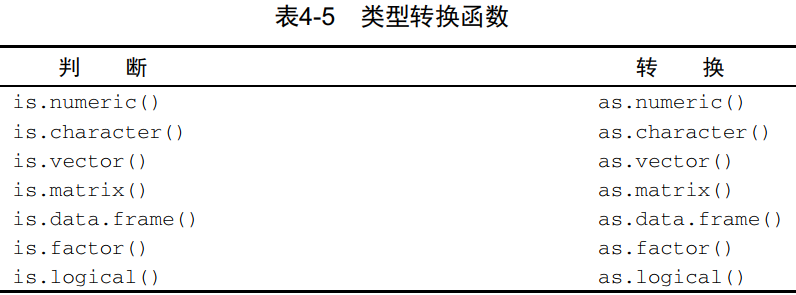
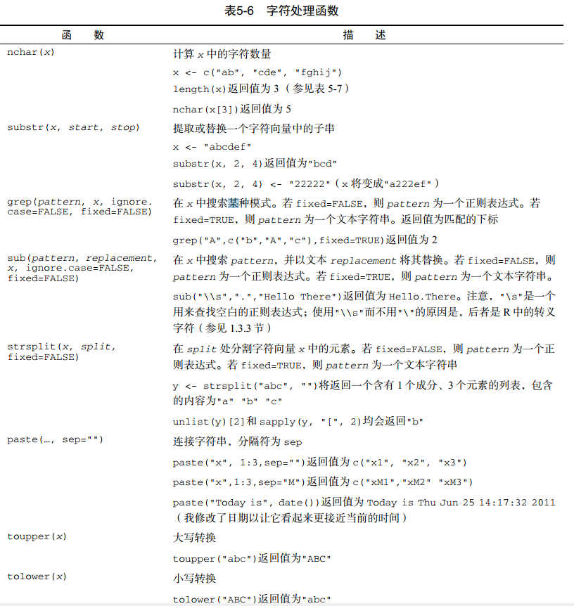

# Part1 第一部分 入门
---
# 第1章 R语言介绍
## 1.1 为何要使用R
## 1.2 R的获取和安装
CRAN Comprehensive R Archive Network http://cran.r-project.org
## 1.3 R的使用
R是一种区分大小写的解释型语言。

可以在命令提示符（>）后每次输入并执行一条命令，或者一次性执行写在脚本文件中的一组命令。

R中有多种数据类型，包括向量、矩阵、数据框（与数据集类似）以及列表（各种对象的集合）。

注释由符号#开头。在#之后出现的任何文本都会被R解释器忽略。
### 1.3.1 新手上路
### 1.3.2 获取帮助
### 1.3.3 工作空间
工作空间（workspace）就是当前R的工作环境，它存储着所有用户定义的对象（向量、矩阵、函数、数据框、列表）。
在一个R会话结束时，你可以将当前工作空间保存到一个镜像中，并在下次启动R时自动载入它。

当前的工作目录（ working directory）是R用来读取文件和保存结果的默认目录。我们可以使用函数getwd()来查看当前的工作目录，或使用函数setwd()设定当前的工作目录。如果需要读入一个不在当前工作目录下的文件，则需在调用语句中写明完整的路径。

### 1.3.4 输入和输出

## 1.4 包
### 1.4.1 什么是包
包是R函数、数据、预编译代码以一种定义完善的格式组成的集合。计算机上存储包的目录称为库（library）。
### 1.4.2 包的安装
### 1.4.3 包的载入
### 1.4.4 包的使用方法
## 1.5 批处理
## 1.6 将输出用为输入：结果的重用
## 1.7 处理大数据集
要考虑到两个问题：数据集的大小和要应用的统计方法。
## 1.8 示例实践
## 1.9 小结
---
# 第2章 创建数据集
按照个人要求的格式来创建含有研究信息的数据集，这是任何数据分析的第一步。
在R中，这个任务包括以下两步：
- 选择一种数据结构来存储数据；
- 将数据输入或导入到这个数据结构中。
## 2.1 数据集的概念
数据集通常是由数据构成的一个矩形数组，行表示观测，列表示变量。
## 2.2 数据结构
R拥有许多用于存储数据的对象类型，包括标量、向量、矩阵、数组、数据框和列表。

**对象**（object）是指可以赋值给变量的任何事物，包括常量、数据结构、函数，甚至图形。
对象都拥有某种**模式**，描述了此对象是如何存储的，以及某个类，像print这样的泛型函数表明如何处理此对象。

数据框（data frame）是R中用于存储数据的一种结构：列表示变量，行表示观测。在同一个数据框中可以存储不同类型的变量。数据框将是你用来存储数据集的主要数据结构。

因子（factor）是名义型变量或有序型变量。它们在R中被特殊地存储和处理。

### 2.2.1 向量
向量是用于存储数值型、字符型或逻辑型数据的一维数组。
执行组合功能的函数c()可用来创建向量。

单个向量中的数据必须拥有相同的类型或模式（数值型、字符型或逻辑型）。
同一向量中无法混杂不同模式的数据。

标量是只含一个元素的向量。它们用于保存常量。
### 2.2.2 矩阵
矩阵是一个二维数组，只是每个元素都拥有相同的模式（数值型、字符型或逻辑型）。
可通过函数matrix()创建矩阵。
``` R
myymatrix <- matrix(vector, nrow=nmber_of_rows, ncol=number_of_columns,
                    byrow=logical_value, dimnames=list(
                    char_vector_rownames, char_vector_colnames))
```
其中vector包含了矩阵的元素，nrow和ncol用以指定行和列的维数，dimnames包含了可选的、以字符型向量表示的行名和列名。
选项byrow则表明矩阵应当按行填充（byrow=TRUE）还是按列填充（byrow=FALSE），默认情况下按列填充。

矩阵都是二维的，和向量类似，矩阵中也仅能包含一种数据类型。

### 2.2.3 数组
数组（array）与矩阵类似，但是维度可以大于2。
数组可通过array函数创建，形式如下：
```R
myarray <- array(vector, dimensions, dimnames)
```
其中，vector包含了数组中的数据，dimensions是一个数值型向量，给出了各个维度下标的最大值，而dimnames是可选的、各维度名称标签的列表。

数组是矩阵的一个自然推广。
它们在编写新的统计方法时可能很有用。
像矩阵一样，数组中的数据也只能拥有一种模式。

### 2.2.4 数据框
由于不同的列可以包含不同模式（数值型、字符型等）的数据，数据框的概念较矩阵来说更为一般。
数据框将是你在R中最常处理的数据结构。
```R
mydata <- data.frame(col1, col2, col3)
```
其中，列向量col1、col2、col3等可为任何类型（如字符型、数值型或逻辑型）。每一列的名称可由函数names指定。

每一列数据的模式必须唯一，不过你却可以将多个模式的不同列放到一起组成数据框。
1. attach(), detach(), 和 with()

函数attach()可将数据框添加到R的搜索路径中。R在遇到一个变量名以后，将检查搜索路径中的数据框。
函数detach()将数据框从搜索路径中移除。

2. 实例标识符
在R中，实例标识符（case identifier）可通过数据框操作函数中的rowname选项指定。   
将patientID指定为R中标记各类打印输出和图形中实例名称所用的变量。

### 2.2.5 因子
变量可归结为名义型、有序型或连续型变量。

名义型变量是没有顺序之分的类别变量。

有序型变量斯奥是一种顺序关系，而非数量关系。

连续型变量可以呈现为某个范围内的任意值，并同时表示了顺序和数量。

类别（名义型）变量和有序类别（有序型）变量在R中成为因子（factor）。
因子在R中非常重要，因为它决定了数据的分析方式以及如何进行视觉呈现。

函数factor()以一个整数向量的形式存储类别值，整数的取值范围是[1..k]（其中k是名义型变量中唯一值的个数），同时一个由字符串（原始值）组成的内部向量将映射到这些整数上。

### 2.2.6 列表
列表（list）是R的数据类型中最为复杂的一种。
一般来说，列表就是一些对象（或成分，component）的有序集合。
列表允许你整合若干（可能无关的）对象到单个对象名下。
例如某个列表中可能是若干向量、矩阵、数据框，甚至其他列表的组合。
## 2.3 数据的输入
### 2.3.1 使用键盘输入数据
用R内置的文本编辑器和直接在代码中嵌入数据。
### 2.3.2 从带分隔符的文本文件导入数据
你可以使用read.table()从带分隔符的文本文件中导入数据。此函数可读入一个表格格式的文件并将其保存为一个数据框。
表格的每一行分别出现在文件中每一行。
```R
mydataframe <- read.table(file, options)
```
其中，file是一个带分隔符的ASCII文本文件，options是控制如何处理数据的选项。

### 2.3.3 导入Excel数据
### 2.3.4 导入XML数据
### 2.3.5 从网页抓取数据
网络上的数据，可以通过所谓Web数据抓取（Webscraping）的过程，或对应用程序接口（application programming interface，API）的使用来获得。
### 2.3.6 导入SPSS数据
### 2.3.7 导入SAS数据
### 2.3.8 导入Stata数据
### 2.3.9 导入NetCDF数据
### 2.3.10 导入HDF5数据
### 2.3.11 访问数据库管理系统
1. ODBC接口
2. DBI相关包
### 2.3.12 通过Stat/Transfer导入数据
## 2.4 数据集的标注
为了使结果更易解读，数据分析人员通常会对数据集进行标注。
这种标注包括为变量名添加描述性的标签，以及为类别型变量中的编码添加值标签。
### 2.4.1 变量标签
### 2.4.2 值标签
## 2.5 处理数据对象的实用函数


## 2.6 小结
---
# 第3章 图形初阶
## 3.1 使用图形
R是一个惊艳的图形构建平台。这里我特意使用了构建一词。在通常的交互式会话中，你可以通过逐条输入语句构建图形，逐渐完善图形特征，直至得到想要的结果。
## 3.2 一个简单的例子
## 3.3 图形参数
我们可以通过修改称为图形参数的选项来自定义一幅图形的多个特征（字体、颜色、坐标轴、标签）。
一种方法是通过函数par()来指定这些选项。
以这种方式设定的参数值除非被再次修改，否则将在会话结束前一直有效。
其调用格式为par(optionname=value, optionname=name, ...)。
不加参数地执行par()将生成一个含有当前图形参数设置的列表。
添加参数no.readonly=TRUE可以生成一个可以修改的当前图形参数列表。

指定图形参数的第二种方法是为高级绘图函数直接提供optionname=value的键值对。
这种情况下，指定的选项仅对这幅图形本身有效。
### 3.3.1 符号和线条

### 3.3.2 颜色

### 3.3.3 文本属性


### 3.3.4 图形尺寸与边界尺寸


## 3.4 添加文本、自定义坐标轴和图例
### 3.4.1 标题
可以使用title()函数为图形添加标题和坐标轴标签。
调用格式为：
```R
title(main="main title", sub="subtitle", xlab="x-axis label", ylab="y-axis label")
```
函数title()中亦可指定其他图形参数（如文本大小、字体、旋转角度和颜色）。
### 3.4.2 坐标轴
你可以使用函数axis()来创建自定义的坐标轴，而非使用R中的默认坐标轴。其格式为：
```R
axis(side, at=, labels=, pos=, lty=, col=, las=, tck=, ...)
```


### 3.4.3 参考线
函数abline()可以用来为图形添加参考线。其使用格式为：
```R
abline(h=yvalues, v=xvalues)
```
函数abline()中也可以指定其他图形参数（如线条类型、颜色和宽度）。
### 3.4.4 图例
当图形中包含的数据不止一组时，图例可以帮助你辨别出每个条形、扇形区域或折线各代表哪一类数据。我们可以使用函数legend()来添加图例。其使用格式为：
```R
legend(location, title, legend, ...)
```

### 3.4.5 文本标注
我们可以通过函数text()和mtext()将文本添加到图形上。
text()可向绘图区域内部添加文本，而mtext()则向图形的四个边界之一添加文本。
使用格式分别为：
```R
text(location, "text to place", pos, ...)
mtext("text to place", side, line=n, ...)
```

除了用来添加文本标注以外，text()函数也通常用来标示图形中的点。
我们只需指定一系列的x,y坐标作为位置参数，同时以向量的形式指定要放置的文本。
x,y和文本标签向量的长度应当相同。
### 3.4.6 数学标注
## 3.5 图形的组合
在R中使用函数par()或layout()可以容易地组合多幅图形为一幅总括图形。
你可以在par()函数中使用图形参数mfrow=c(nrows,ncols)来创建按行填充、行数为nrows、列数为ncols的图形矩阵。
另外，可以使用mfcol=c(nrows,ncols)按列填充矩阵。

函数layout()的调用形式为layout(mat)，其中的mat是一个矩阵，它指定了所要组合的多个图形的所在位置。

为了更精确地控制每幅图形的大小，可以由选择地在layout()函数中使用widths=和heights=两个参数。其形式为：
1. widths = 各列宽度值组成的一个向量
2. heights = 各行高度值组成的一个向量
相对宽度可以直接通过数值指定，绝对宽度(以厘米为单位)可以通过函数lcm()来指定。

layout()函数能够让我们轻松地控制最终图形的子图数量和摆放方式，以及这些子图的相对大小。

图形布局的精细控制

可能很多时候，你想通过排布或叠加若干图形来创建单幅的、有意义的图形，这需要有对图形布局的精细控制能力。你可以使用图形参数fig=完成这个任务。

你可以使用图形参数fig=将若干图形以任意排布方式组合到单幅图形中。

## 3.6 小结
---
# 第4章 基本数据管理
## 4.1 一个示例
## 4.2 创建新变量
在典型的研究项目中，你可能需要创建新变量或者对现有的变量进行变换。
这可以通过以下形式的语句来完成：
```R
变量名 <- 表达式
```
以上语句中的“表达式”部分可以包含多种运算符和函数。算术运算符可用于构造公式（formula）。

## 4.3 变量的重编码
重编码涉及根据同一个变量和/或其他变量的现有值创建新值的过程。举例来说，你可能想：
1. 将一个连续型变量修改为一组类别值；
2. 将误编码的值替换成为正确值；
3. 基于一组分数线创建一个表示及格/不及格的变量。

语句variable[condition] <- expression将仅在condition的值为TRUE时执行赋值。
## 4.4 变量的重命名
如果对现有的变量名称不满意，你可以交互地或者以编程的方式修改它们。
可以使用语句：
```R
fix(leadership)
```
来调用一个交互式的编辑器。

若以编程方式，可以通过names()函数来重命名变量。例如：
```R
names(leadership)[2] <- "testDate"
```
最后，plyr包中有一个rename()函数，可用于修改变量名。
rename()函数的使用格式为：
```R
rename(dataframe, c(oldname="newname", oldname="newname", ...))
```
## 4.5 缺失值
在任何规模的项目中，数据都可能由于未作答问题、设备故障或误编码数据的缘故而不完整。
在R中，缺失值以符号NA（Not Available，不可用）表示。
与SAS等程序不同，R中字符型和数值型数据使用的缺失值符号是相同的。

当你在处理缺失值的时候，你要一直记得两件重要的事情。
1. 第一，缺失值被认为是不可比较的，即便是与缺失值自身的比较。这意味着无法使用比较运算符来检测缺失值是否存在。例如，逻辑测试myvar==NA的结果永远不会为TRUE。作为替代，你只能使用处理缺失值的函数（如本节中所述的那些）来识别出R数据对象中的缺失值。
2. 第二， R 并不把无限的或者不可能出现的数值标记成缺失值。再次地，这和其余像SAS之类类似的程序处理这类数值的方式所不同。正无穷和负无穷分别用Inf和–Inf所标记。因此5/0返回Inf。不可能的值（比如说， sin(Inf)）用NaN符号来标记（ not a number，不是一个数）。若要识别这些数值，你需要用到is.infinite()或is.nan()。

### 4.5.1 重编码某些值为缺失值
你可以使用赋值语句将某些值重编码为缺失值。
### 4.5.2 在分析中排除缺失值
确定了缺失值的位置以后，你需要在进一步分析数据之前以某种方式删除这些缺失值。
原因是，含有缺失值的算术表达式和函数的计算结果也是缺失值。

可以通过函数na.omit()移除所有含有缺失值的观测。
na.omit()可以删除所有含有缺失数据的行。

## 4.6 日期值
日期值通常以字符串的形式输入到R中，然后转化为以数值形式存储的日期变量。
函数as.Date()用于执行这种转化。
其语法为as.Date(x, "input_format")，其中x是字符型数据，input_format则给出了用于读入日期的适当格式。

有两个函数对于处理时间戳数据特别使用。
Sys.Date()可以返回当天的日期，而date()则返回当前的日期和时间。
### 4.6.1 将日期转换为字符型变量
### 4.6.2 更进一步
要了解字符型数据转换为日期的更多细节，请查看help(as.Date)和help(strftime)。
要了解更多关于日期和时间格式的知识，请参考help(ISOdatetime)。 lubridate包中包含了许多简化日期处理的函数，可以用于识别和解析日期—时间数据，抽取日期—时间成分（例如年份、月份、日期等），以及对日期—时间值进行算术运算。如果你需要对日期进行复杂的计算，那么timeDate包可能会有帮助。它提供了大量的日期处理函数，可以同时处理多个时区，并且提供了复杂的历法操作功能，支持工作日、周末以及假期。
## 4.7 类型转换
可以使用下列函数来判断数据的类型或者将其转换为指定类型。

## 4.8 数据排序
在R中可以使用order()函数对一个数据框进行排序。默认的排序顺序是升序。在排序变量的前边加一个减号即可得到降序的排序结果。
## 4.9 数据集的合并
### 4.9.1 向数据框添加列
要横向合并两个数据框（数据集），请使用merge()函数。
在多数情况下，两个数据框是通过一个或多个共有变量进行联结的（即一种内联结，inner join）。例如：
```R
total <- merge(dataframeA, dataframeB, by="ID")
```
将dataframeA和dataframeB按照ID进行了合并。类似地，
```R
total <- merge(dataframeA, dataframeB, by=c("ID", "Country"))
```
将两个数据框按照ID和Country进行了合并。类似的横向联结通常用于向数据框中添加变量。

用cbind()进行横向合并

如果要直接横向合并两个矩阵或数据框，并且不需要指定一个公共索引，那么可以直接使用cbind()函数：
```R
total <- cbind(A, B)
```
这个函数将横向合并对象A和对象B。
为了让它正常工作，每个对象必须拥有相同的行数，以同顺序排序。
### 4.9.2 向数据框添加行
要纵向合并两个数据框（数据集），请使用rbind()函数：
```R
total <- rbind(dataframeA, dataframeB)
```
两个数据框必须拥有相同的变量，不过它们的顺序不必一定相同。
如果dataframeA中拥有dataframeB中没有的变量，请在合并它们之前做以下某种处理：
1. 删除dataframeA中的多余变量；
2. 在dataframeB中创建追加的变量并将其值设为NA（缺失）。

纵向联结通常用于向数据框中添加观测。
## 4.10 数据集取子集
### 4.10.1 选入（保留）变量
从一个大数据集中选择有限数量的变量来创建一个新的数据集是常有的事。
数据框中的元素是通过dataframe[row indices, column indices]这样的记号来访问的。
### 4.10.2 剔除(丢弃)变量
```R
myvars <- names(leadership) %in% c("q3", "q4")
newdata <- leadership[!myvars]
```
在知道q3和q4是第8个和第9个变量的情况下，可以使用语句：
```R
newdata <- leadership[c(-8, -9)]
```
最后相同的变量删除工作亦可通过：
```R
leadership$q3 <- leadership$q4 <- NULL
```
丢弃变量是保留变量的逆向操作。选择哪一种方式进行变量筛选依赖于两种方式的编码难易程度。
如果有许多变量需要丢弃，那么直接保留需要留下的变量可能更简单，反之亦然。
### 4.10.3 选入观测
选入或剔除观测（行）通常是成功的数据准备和数据分析的一个关键方面。
### 4.1.0.4 subset()函数
冒号运算符from:to。在这里，它表示数据框中变量from到变量to包含的所有变量。
### 4.1.0.5 随机抽样
在数据挖掘和机器学习领域，从更大的数据集中抽样是很常见的做法。举例来说，你可能希望选择两份随机样本，使用其中一份样本构建预测模型，使用另一份样本验证模型的有效性。sample()函数能够让你从数据集中（有放回或无放回地）抽取大小为n的一个随机样本。

你可以使用以下语句从leadership数据集中随机抽取一个大小为3的样本：
```R
mysample <- leadership[sample(1:nrow(leadership), 3, replace=FALSE),]
```
sample()函数中的第一个参数是一个由要从中抽样的元素组成的向量。在这里，这个向量是1到数据框中观测的数量，第二个参数是要抽取的元素数量，第三个参数表示无放回抽样。sample()函数会返回随机抽样得到的元素，之后即可用于选择数据框中的行。

* 抽取和校正调查样本（sampling包）
* 分析复杂调查数据（survey包）

## 4.11 使用SQL语句操作数据框
SQL 结构化查询语言 sqldf包
## 4.12 小结
---
# 第5章 高级数据管理
## 5.1 一个数据处理难题
## 5.2 数值和字符处理函数
### 5.2.1 数学函数


### 5.2.2 统计函数


### 5.2.3 概率函数
在R中，概率函数形如：
```R
[dpqr] distribution_abbreviation()
```
其中第一个字母表示其所指分布的某一方面：

d = 密度函数(density)

p = 分布函数(distribution function)

q = 分位数函数(quantile function)

r = 生成随机数(随机偏差)


* 密度函数 dnorm
* 分布函数 pnorm
* 分位数函数 qnorm
* 随机数生成函数 rnorm

1. 设定随机数种子
2. 生成多元正态数据

### 5.2.4 字符处理函数


### 5.2.5 其他实用函数


### 5.2.6 将函数应用于矩阵和数据框
R函数的诸多有趣特性之一，就是它们可以应用到一系列的数据对象上，包括标量、向量、矩阵、数组和数据框。

R中提供了一个apply()函数，可将一个任意函数“应用”到矩阵、数组、数据框的任何维度上。 apply()函数的使用格式为：
```R
apply(x, MARGIN, FUN, ...)
```
其中， x为数据对象， MARGIN是维度的下标， FUN是由你指定的函数，而...则包括了任何想传递给FUN的参数。在矩阵或数据框中， MARGIN=1表示行， MARGIN=2表示列。

## 5.3 数据处理难题的一套解决方案

## 5.4 控制流
在正常情况下， R程序中的语句是从上至下顺序执行的。但有时你可能希望重复执行某些语句，仅在满足特定条件的情况下执行另外的语句。这就是控制流结构发挥作用的地方了。

R拥有一般现代编程语言中都有的标准控制结构。首先你将看到用于条件执行的结构，接下来是用于循环执行的结构。

为了理解贯穿本节的语法示例，请牢记以下概念：
* 语句（ statement）是一条单独的R语句或一组复合语句（包含在花括号{ }中的一组R语句，使用分号分隔）；
* 条件（ cond）是一条最终被解析为真（ TRUE）或假（ FALSE）的表达式；
* 表达式（ expr）是一条数值或字符串的求值语句；
* 序列（ seq）是一个数值或字符串序列。

### 5.4.1 重复和循环
循环结构重复地执行一个或一系列语句，直到某个条件不为真为止。循环结构包括for和while结构。
1. for结构

for循环重复地执行一个语句，直到某个变量的值不再包含在序列seq中为止。语法为：
```R
for (var in seq) statement
```
2. while结构

while循环重复地执行一个语句，直到条件不为真为止。语法为：
```R
while (cond) statement
```

在处理大数据集中的行和列时， R中的循环可能比较低效费时。只要可能，最好联用R中的内建数值/字符处理函数和apply族函数。

### 5.4.2 条件执行
在条件执行结构中，一条或一组语句仅在满足一个指定条件时执行。条件执行结构包括if-else、 ifelse和switch。
1. if-else结构

控制结构if-else在某个给定条件为真时执行语句。也可以同时在条件为假时执行另外的语句。语法为：
```R
if (cond) statement
if (cond) statement1 else statement2
```

2. ifelse结构

ifelse结构是if-else结构比较紧凑的向量化版本，其语法为：
```R
ifelse(cond, statement1, statement2)
```
若cond为TRUE，则执行第一个语句；若cond为FALSE，则执行第二个语句。

3. switch结构

switch根据一个表达式的值选择语句执行。语法为：
```R
switch(expr, ...)
```
其中的...表示与expr的各种可能输出值绑定的语句。

## 5.5 用户自编函数
R的最大优点之一就是用户可以自行添加函数。事实上， R中的许多函数都是由已有函数构成的。一个函数的结构看起来大致如此：
```R
myfunction <- function(arg1, arg2, ... ){
statements
return(object)
}
```
函数中的对象只在函数内部使用。返回对象的数据类型是任意的，从标量到列表皆可。

有若干函数可以用来为函数添加错误捕获和纠正功能。你可以使用函数warning()来生成一条错误提示信息，用message()来生成一条诊断信息，或用stop()停止当前表达式的执行并提示错误。
## 5.6 整合与重构
R中提供了许多用来整合（ aggregate）和重塑（ reshape）数据的强大方法。在整合数据时，往往将多组观测替换为根据这些观测计算的描述性统计量。在重塑数据时，则会通过修改数据的结构（行和列）来决定数据的组织方式。
### 5.6.1 转置
转置（反转行和列）也许是重塑数据集的众多方法中最简单的一个了。使用函数t()即可对一个矩阵或数据框进行转置。对于后者，行名将成为变量（列）名。
### 5.6.2 整合数据
在R中使用一个或多个by变量和一个预先定义好的函数来折叠（ collapse）数据是比较容易的。调用格式为：
```R
aggregate(x, by, FUN)
```
其中x是待折叠的数据对象， by是一个变量名组成的列表，这些变量将被去掉以形成新的观测，而FUN则是用来计算描述性统计量的标量函数，它将被用来计算新观测中的值。
### 5.6.3 reshape2包
大致说来，你需要首先将数据融合（ melt），以使每一行都是唯一的标识符变量组合。然后将数据重铸（ cast）为你想要的任何形状。在重铸过程中，你可以使用任何函数对数据进行整合。
1. 融合
数据集的融合是将它重构为这样一种格式：每个测量变量独占一行，行中带有要唯一确定这个测量所需的标识符变量。
2. 重铸
dcast()函数读取已融合的数据，并使用你提供的公式和一个（可选的）用于整合数据的函数将其重塑。调用格式为：
```R
newdata <- dcast(md, formula, fun.aggregate)
```
其中的md为已融合的数据， formula描述了想要的最后结果，而fun.aggregate是（可选的）数据整合函数。其接受的公式形如：
```R
rowvar1 + rowvar2 + ... ~ colvar1 + colvar2 + ...
```
在这一公式中， rowvar1 + rowvar2 + ...定义了要划掉的变量集合，以确定各行的内容，而colvar1 + colvar2 + ...则定义了要划掉的、确定各列内容的变量集合。
## 5.7 小结

---
# Part2 第二部分 基本方法
# 第6章 基本图形
## 6.1 条形图
条形图通过垂直的或水平的条形展示了类别型变量的分布（频数）。函数barplot()的最简
单用法是：
```R
barplot(height)
```
其中的height是一个向量或一个矩阵。

### 6.1.1 简单的条形图
### 6.1.2 堆砌条形图和分组条形图
### 6.1.3 均值条形图
### 6.1.4 条形图的微调
### 6.1.5 棘状图
在结束关于条形图的讨论之前，让我们再来看一种特殊的条形图，它称为棘状图（ spinogram）。棘状图对堆砌条形图进行了重缩放，这样每个条形的高度均为1，每一段的高度即表示比例。棘状图可由vcd包中的函数spine()绘制。

## 6.2 饼图
饼图在商业世界中无所不在，然而多数统计学家，包括相应R文档的编写者却都对它持否定态度。相对于饼图，他们更推荐使用条形图或点图，因为相对于面积，人们对长度的判断更精确。也许由于这个原因， R中饼图的选项与其他统计软件相比十分有限。

饼图可由以下函数创建：
```R
pie(x, labels)
```
其中x是一个非负数值向量，表示每个扇形的面积，而labels则是表示各扇形标签的字符型向量。

## 6.3 直方图

# 第8章 回归
回归分析是统计学的核心。
它其实是一个广义的概念，通指哪些用一个或多个预测变量（也称自变量或解释变量）来预测响应变量（也称因变量、校标变量或结果变量）的方法。
通常，回归分析可以用来挑选与响应变量相关的解释变量，可以描述两者的关系，也可以生成一个等式，通过解释变量来预测响应变量。


* 简单线性 用一个量化的解释变量预测一个量化的响应变量
* 多项式 用一个量化的解释变量预测一个量化的响应变量，模型的关系是n阶多项式
* 多元线性 用两个或多个量化的解释变量预测一个量化的响应变量

OLS普通最小二乘回归法

# 附录A 图形用户界面
# 附录B 自定义启动环境
通过自定义启动环境可以设置R选项，设置工作目录，加载常用的包，加载用户编写的函数，设置默认的CRAN下载网站以及执行其他各种常见任务。

有点问题，我们设置的默认启动包未能成功。

# 附录C 从R中导出数据
## C.1 符号分隔文本文件
可以用write.table()函数将R对象输出到符号分隔文件中。函数使用方法是：
```R
write.table(x, outfile, sep=delimiter, quote=TRUE, na="NA")
```
其中x是要输出的对象， outfile是目标文件。例如，这条语句：
```R
write.table(mydata, "mydata.txt", sep=",")
```
会将mydata数据集输出到当前目录下逗号分隔的mydata.txt文件中。用路径（例如c:/myprojects/mydata.txt）可以将输出文件保存到任何地方。用sep="\t"替换sep=","，数据就会保存到制表符分隔的文件中。默认情况下，字符串是放在引号（ ""）中的，缺失值用NA表示。

## C.2 Excel电子表格
xlsx包中的write.xlsx()函数可以将R数据框写入到Excel 2007文件中。使用方法是：
```R
library(xlsx)
write.xlsx(x, outfile, col.Names=TRUE, row.names=TRUE,
sheetName="Sheet 1", append=FALSE)
```
例如，这条语句：
```R
library(xlsx)
write.xlsx(mydata, "mydata.xlsx")
```
会将mydata数据框保存到当前目录下的Excel文件mydata.xlsx的工作表（默认是Sheet 1）中。默认情况下，数据集中的变量名称会被作为电子表格头部，行名称会放在电子表格的第一列。函数会覆盖已存在的mydata.xlsx文件。

## C.3 统计学程序